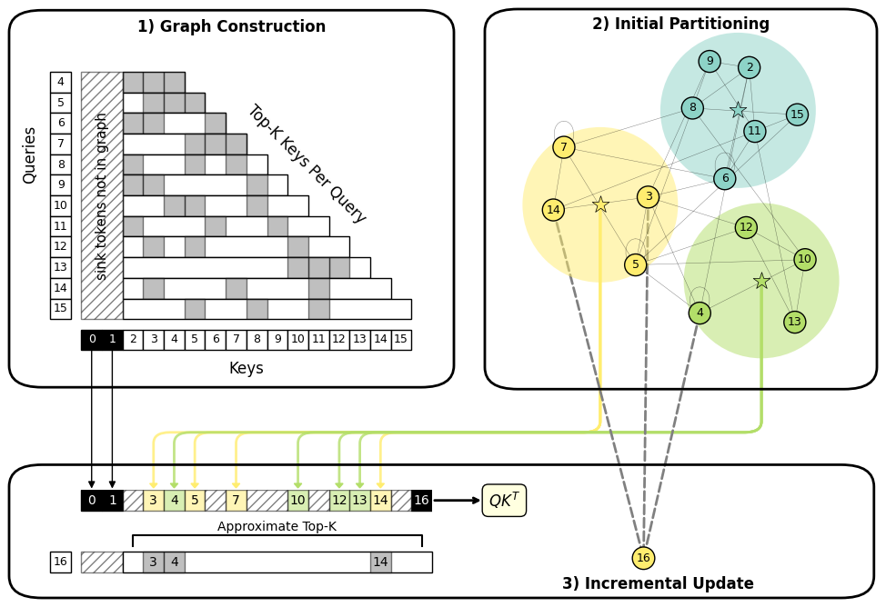

# CommunityKV: Efficient Long-Context Decoding via Graph Partitioning



CommunityKV is a training-free framework for sparse attention over long
contexts. It treats the $QK^\top$ scores already computed during prefill
as a token graph and partitions it into communities with the Leiden
algorithm, giving each token a community label. At decode time the
next-token query scores against community centroids — not all keys — and
exact attention runs on a small retrieved subset, with a constant-time
local rule assigning new tokens to existing communities so streaming
decoding continues without re-clustering.

On the Qwen3 family (4B–14B), CommunityKV matches exact FlashAttention
accuracy on LongBench v2 and BABILong while delivering up to 1.86×
decoding throughput at under 8% prefill overhead. Full method,
complexity analysis, and ablations are in the paper.

The repo has two top-level packages:

- **`community_kv/`** — the library. Patched FlashAttention forward with
  fused row-wise top-K, native CUDA Leiden, and the HF-pluggable
  `CommunityKVAttention` implementation.
- **`evals/`** — the eval harness. Dataset registry, HF model loader
  with YARN rope scaling, streaming runner, and the
  `community-kv-eval` console script.

## Install

```bash
git clone <repo-url>
cd community_kv
pip install --no-build-isolation -e .[dev]
```

A single `pip install` builds and installs everything: it initialises
the FlashAttention submodule, applies the top-K patch, builds the
patched FlashAttention and the Leiden CUDA extension, and installs
`community_kv` and `evals` in editable mode. The first build compiles
the FlashAttention kernel and takes 30–60 minutes; later installs reuse
the cached binaries (see below) and finish in seconds.

The fused kernel is the patched FlashAttention forward at
`third_party/flash-attention/` (pinned to tag `v2.8.3`) plus
`community_kv/attention/flash-attention.patch`. The patch adds a
per-thread WarpSelect-style top-K probe — each thread maintains a sorted
top-K plus a small overflow buffer in registers, and warp-level
cross-quad merges produce the final per-query top-K — along with new
arguments (`return_topk`, `topk_K`, `exclude_sink_tokens`) on the
upstream forward.

### Build artifact cache

Compiled binaries are cached at `<repo-root>/.build/` (gitignored). The
build verifies a cached binary by trying to import it before reusing
it, so an unusable artifact triggers a rebuild automatically. Override
the location with `COMMUNITY_KV_BUILD_CACHE=<absolute-path>` to share
the cache across checkouts; set it to `0` or empty to disable caching.

## Quick start

```python
from transformers import AutoModelForCausalLM
from community_kv import COMMUNITY_KV_ATTN_IMPL, CommunityKVAttention, GraphRuntime

graph_runtime = GraphRuntime()
attn = CommunityKVAttention(graph_runtime=graph_runtime)
attn.register(
    kappa=8, num_sink=10, lam=0.5,
    leiden_resolution=1.0, leiden_max_iter=2,
    max_new_tokens=128, token_budget=4096,
)

model = AutoModelForCausalLM.from_pretrained(
    "Qwen/Qwen3-8B",
    attn_implementation=COMMUNITY_KV_ATTN_IMPL,
)
```

## Layout

```
.
├── third_party/flash-attention/     upstream FlashAttention source (submodule)
├── community_kv/                    the library
│   ├── attention/                   the sparse attention forward — picks
│   │                                a small set of relevant tokens per
│   │                                query, then runs exact attention only
│   │                                over that set
│   └── graph/                       turns each layer's attention scores
│       │                            into a graph of tokens, partitions
│       │                            it into communities, and tracks how
│       │                            communities evolve as decoding proceeds
│       └── _leiden/                 the actual community-detection kernel
│                                    (CUDA), called by the graph layer
└── evals/                           the eval harness (separate from the
    │                                library — only consumes its public API)
    ├── main.py                      the `community-kv-eval` console script
    ├── runner.py                    the per-sample loop: tokenize, run
    │                                prefill, decode, score, log
    ├── datasets/                    benchmark adapters — currently
    │                                LongBench-v2 and BABILong
    └── models/                      Hugging Face model loading with
                                     long-context (YARN) rope scaling
```

Tests under `tests/` mirror the source layout one-to-one
(`tests/community_kv/...` for the library, `tests/evals/...` for the
harness).
