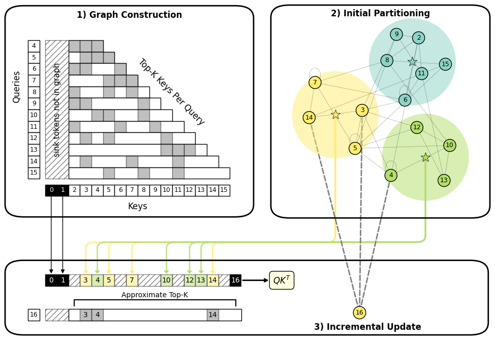

# CommunityKV: Efficient Long-Context Decoding via Graph Partitioning



CommunityKV is a training-free framework for sparse attention over long
contexts. It treats the $QK^\top$ scores already computed during prefill
as a token graph and partitions it into communities with the Leiden
algorithm, giving each token a community label. At decode time the
next-token query scores against community centroids — not all keys — and
exact attention runs on a small retrieved subset, with a constant-time
local rule assigning new tokens to existing communities so streaming
decoding continues without re-clustering.

The package is organized around two implementation domains:

- `community_kv.attention`: cache, FA integration, selection, and decode;
- `community_kv.graph`: graph state, partitioning, Leiden, and online updates.

## Install

```bash
pip install 'git+https://github.com/.../community_kv.git'
```

CommunityKV requires Linux x86-64, a CUDA 12.8 toolkit with `nvcc`, a compatible
NVIDIA driver, `git`, and network access to GitHub. pip installs the pinned
Python build dependencies in an isolated environment.

During installation, the build downloads pinned FlashAttention v2.8.3 and its
CUTLASS dependency, applies `third_party/flash_attention/community-kv.patch`,
and compiles the FA and CommunityKV CUDA extensions. Downloaded source is cached
under `~/.cache/community_kv/`.

The evaluation helpers require the optional evaluation dependency:

```bash
pip install 'community-kv[eval] @ git+https://github.com/.../community_kv.git'
```

## Quick start

Register the CommunityKV attention implementation once per model, then call
`runtime.generate()`:

```python
import torch
from transformers import AutoModelForCausalLM, AutoTokenizer

from community_kv import (
    CommunityKVAttention,
    CommunityKVConfig,
    CommunityKVRuntime,
    PartitionConfig,
)
from evals.resolutions import load_model_resolutions

model_id = "Qwen/Qwen3-8B"
max_new_tokens = 128
tokenizer = AutoTokenizer.from_pretrained(model_id)
model = AutoModelForCausalLM.from_pretrained(
    model_id,
    torch_dtype=torch.bfloat16,
).to("cuda:0")

resolutions = load_model_resolutions(
    model_id,
    num_layers=model.config.num_hidden_layers,
)

prompt = (
    "Explain how graph partitioning can reduce long-context attention cost "
    "while preserving access to relevant tokens, including the principal "
    "accuracy and systems tradeoffs."
)
inputs = tokenizer.apply_chat_template(
    [{"role": "user", "content": prompt}],
    add_generation_prompt=True,
    enable_thinking=False,
    tokenize=True,
    return_dict=True,
    return_tensors="pt",
).to(model.device)
with CommunityKVRuntime(
    config=CommunityKVConfig(),
    partition=PartitionConfig(),
    num_layers=model.config.num_hidden_layers,
    max_decode_tokens=max_new_tokens - 1,
) as runtime:
    model.config._attn_implementation = CommunityKVAttention(runtime).register()
    output = runtime.generate(
        model,
        **inputs,
        resolutions=resolutions,
        max_new_tokens=max_new_tokens,
    )
    generated = output[0, inputs.input_ids.shape[1]:]
print(tokenizer.decode(generated, skip_special_tokens=True))
```

## Layout

```text
.
├── community_kv/                    the library
│   ├── attention/                   cache, fused prefill, sparse decode,
│   │                                and Hugging Face integration
│   ├── graph/                       graph state, Leiden partitioning, and
│   │                                online community updates
│   └── runtime.py                   end-to-end request coordination
├── evals/                           the evaluation harness
│   ├── cli/                         evaluation and tuning commands
│   ├── datasets/                    benchmark adapters
│   ├── models/                      Hugging Face model loading and profiles
│   └── runner.py                    per-sample prefill, decode, and scoring
├── tests/                           synthetic tests mirroring source layout
└── third_party/flash_attention/     patch applied to pinned FA source
```
